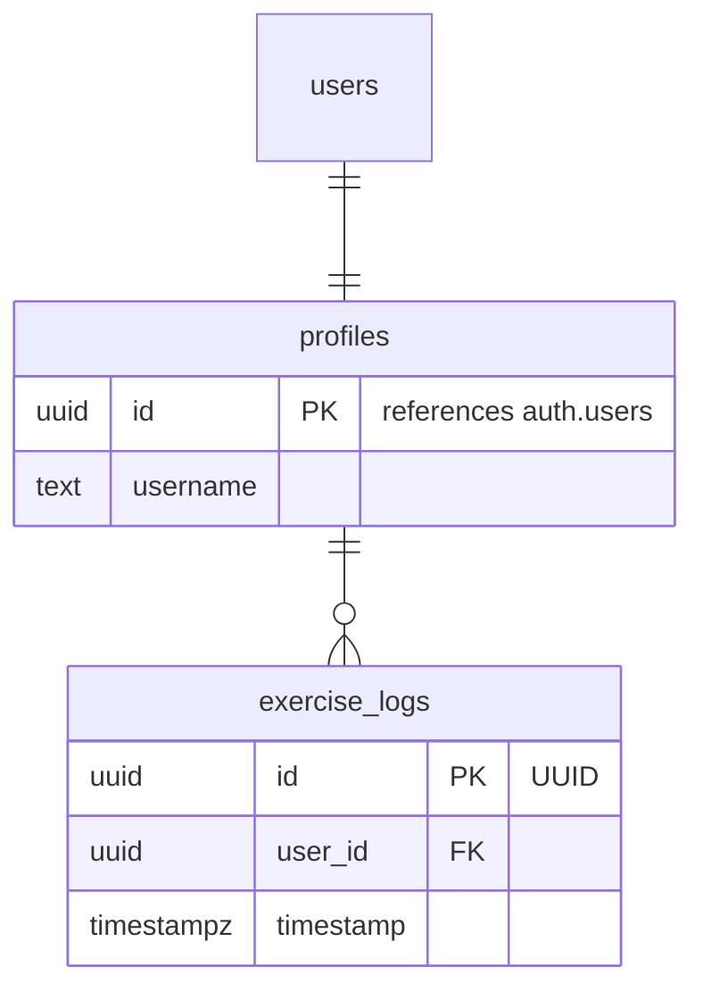

```mermaid
erDiagram
  users ||--|| profiles : ""
  profiles ||--o{ exercise_logs : ""
  
  %% https://supabase.com/docs/guides/auth/managing-user-data
  profiles {
    uuid id PK "references auth.users"
    text username
  }

  exercise_logs {
    uuid id PK "UUID"
    uuid user_id FK
    timestampz timestamp
  }
```
